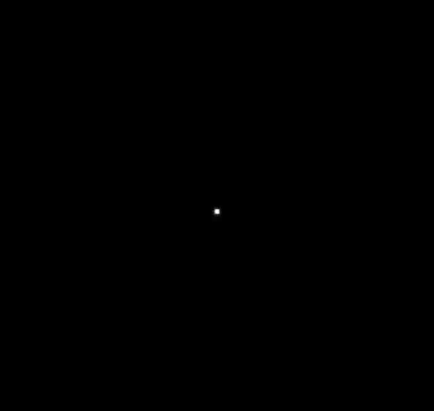

  

<h1 align="center">Hi 👋🏻, I'm Raphael</h1>

<h3 align="center">Software Engineering Student</h3>

  <picture>
    <source media="(prefers-color-scheme: dark)" srcset="https://readme-typing-svg.demolab.com?font=JetBrains+Mono&weight=600&size=22&pause=1200&color=FFFFFF&center=true&vCenter=true&width=700&height=60&lines=%3E+Currently+a+level+1+dev;%3E+Putting+together+my+build;%3E+Learning+HTML%2C+CSS+and+JavaScript;%3E+Passionate+about+technology" />
    
  </picture>

<h2 align="center">🚀 About Me</h2>

I'm currently a level 1 dev, but I'm putting together my build.

Software Engineering student at FAMETRO College. Passionate about technology, I am building my career path with a focus on software development.

- 🏢 Working at **I3M Engenharia**
- 📍 Based in **Manaus/AM, Brazil**
- 🌱 Currently practicing **HTML, CSS and JavaScript**

<h2 align="center">🤝 Connect</h2>

<h2 align="center">💻 Tech Stack</h2>

<h2 align="center">📊 GitHub Stats</h2>

 

<h2 align="center">⌘ Commit Activity</h2>

  

<picture>
  <source media="(prefers-color-scheme: dark)" srcset="https://capsule-render.vercel.app/api?type=waving&color=FFFFFF&height=100&section=footer" />
  
</picture>

